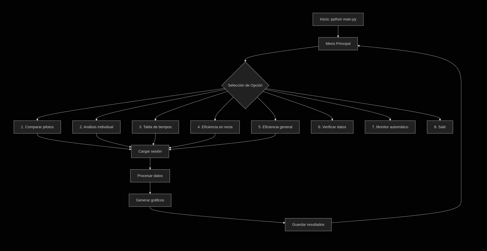

# 📊 Análisis de Datos de Fórmula 1 (Temporada 2025)

Este proyecto permite descargar, procesar y analizar datos de la Fórmula 1
utilizando la librería [FastF1](https://theoehrly.github.io/Fast-F1/).
El objetivo es generar visualizaciones y reportes para entender mejor el
desarrollo de cada carrera de la temporada 2025.

---

## 📂 Estructura del proyecto
f1-analytics-pro/
│
├── 📁 CÓDIGO FUENTE
│   ├── main.py                 # 🏠 Programa principal con menú y funcionalidades
│   ├── constantes.py           # 🎨 Configuración de colores y constantes
│   └── requirements.txt        # 📦 Dependencias del proyecto
│
├── 📁 DATOS Y CACHE
│   └── cache/                  # 💾 Cache de FastF1 (se crea automáticamente)
│       ├── fastf1/
│       │   ├── api/
│       │   ├── events/
│       │   └── sessions/
│       └── ... (datos descargados de la API)
│
├── 📁 OUTPUT Y RESULTADOS
│   └── output/
│       └── figures/            # 🖼️  Gráficos generados
│           ├── violin_comparacion_Monaco_2025_Qualifying.png
│           ├── ritmo_individual_VER_Spanish_GP_2025_FP1.png
│           ├── eficiencia_recta_Monaco_2025_Race.png
│           └── eficiencia_general_Silverstone_2025_Qualifying.png
│
├── 📁 LOGS Y METADATOS
│   └── f1_analytics.log        # 📝 Logs de ejecución y errores
│
└── 📁 DOCUMENTACIÓN
    ├── README.md               # 📚 Documentación principal
    ├── estructura.md           # 🗂️ Este archivo
    └── examples/               # 💡 Ejemplos de uso

# ✅ Flujo de ejecución

